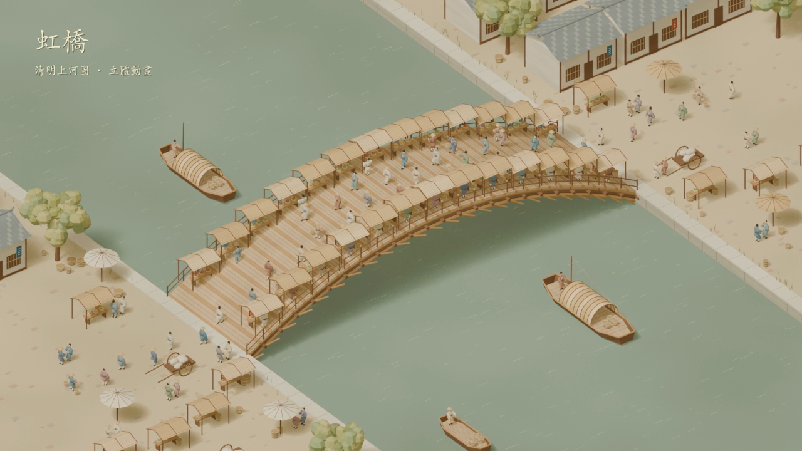

# 虹橋・入畫

可以旋轉、縮放、平移視角的清明上河圖意境 3D 網站，包含 96 位人物與 30 秒場景動畫。訪客使用一般瀏覽器即可觀看，不需要安裝 Blender。



## 操作

| 裝置 | 操作 |
|---|---|
| 滑鼠 | 左鍵拖曳旋轉、滾輪縮放、右鍵拖曳平移 |
| 手機與平板 | 單指旋轉、雙指縮放或平移 |
| 視角按鈕 | 全景、橋上市集、河上舟行、河岸人家 |
| 動畫 | 播放、暫停、拖曳時間軸、0.5×／1×／1.5× |
| 鍵盤（先點選 3D 場景） | 空白鍵播放／暫停、＋／− 縮放、R 重設視角 |

動畫播放至 30 秒後停止，按播放即可重播。自由視角不受原影片攝影機限制。網頁會尊重作業系統的「減少動態效果」設定，啟用時預設暫停。

## 本機預覽

macOS 直接雙擊 `本機預覽.command`，不需要先切換終端機資料夾，也不需要安裝 Node.js。

開發者可以使用 Node.js 22.12 以上的相容版本：

```bash
npm ci
npm run dev
```

## 發佈到 GitHub Pages

本專案為 `knut921/qingming-3d` 準備。啟用 Pages 後預期網址為 `https://knut921.github.io/qingming-3d/`；是否已上線，請以 GitHub Pages 顯示的狀態為準。

1. 在 GitHub 帳號 `knut921` 建立公開儲存庫 `qingming-3d`，上傳本資料夾已納入 Git 的檔案。
2. 在儲存庫 **Settings → Pages** 選 **Deploy from a branch**。
3. 分支選 **main**，資料夾選 **/docs**，按 **Save**。
4. 等候 GitHub 完成發佈，再開啟 Pages 提供的公開網址。

`docs/` 已經是可直接發佈的完整網站，包含網頁、模型、解碼器與影片。JavaScript 依賴已打包，不需要伺服器後端。所有資產都使用相對路徑，適合 GitHub Pages 的專案子路徑。

修改程式後執行：

```bash
npm run build
git add .
git commit -m "Update interactive scene"
git push
```

`npm run build` 會同步更新 `docs/`，GitHub Pages 會從新提交重新發佈。

## 模型與效能

- `public/models/qingming.glb`：約 6.4 MB，Meshopt 壓縮，96 個人物骨架、1 組完整 30 秒場景動畫。
- `public/tour.mp4`：原先製作的 30 秒影片，可用作觀看替代方案。
- Blender 程序材質轉為網頁頂點色，減少材質切換；網頁燈光與離線影片略有差異。
- `.blend`、720 格渲染 PNG、原始未壓縮 GLB、Node 套件與快取均不納入網站 Git 儲存庫。
- 公開網站會讓訪客取得載入的 3D 模型，頁面也提供 GLB 下載。

這是依使用者提供的原畫局部所做的風格化重建，並非逐一精確還原原畫人物或歷史建築。

## 驗證

已在 Chrome 測試桌面 1440 × 960、手機 390 × 844、播放與暫停、時間拖曳、骨架姿勢變化、旋轉、平移、縮放、預設視角、下載與減少動態效果。可執行 `npm run test:browser` 重跑；預設測試本機連接埠 4173，可用 `VIEWER_URL` 指定其他網址。

GLB 結構驗證沒有錯誤；驗證器對 Meshopt 延伸支援有限，並會對骨架位於父節點下提出一般警告，實際瀏覽器的模型與動作已另外檢查。

## 技術參考

- [Three.js GLTFLoader](https://threejs.org/docs/pages/GLTFLoader.html)
- [GitHub Pages 發佈來源設定](https://docs.github.com/en/pages/getting-started-with-github-pages/configuring-a-publishing-source-for-your-github-pages-site)

Three.js 及 Meshopt 的第三方授權見 `THIRD_PARTY_NOTICES.md`。模型与動畫由本專案程式建立；此儲存庫未指定額外的再授權條款。
